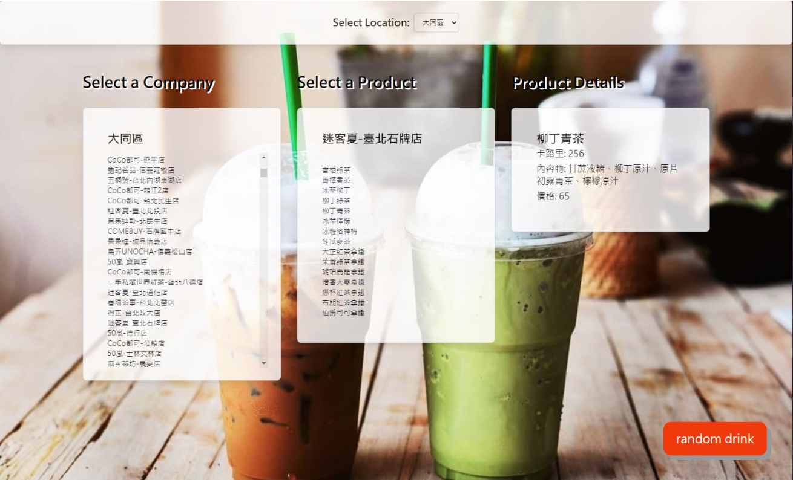
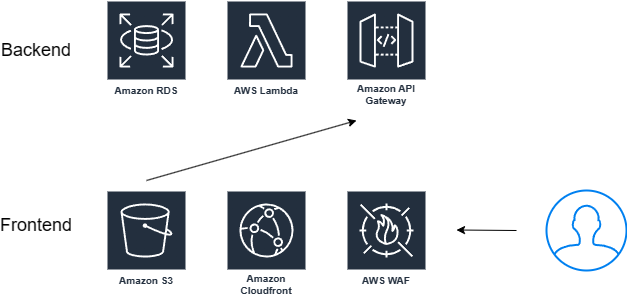

# drink-recommend-system

## feature

* list drinks by location
* random drink recommand

## architecture
this project is build on aws. the architecture is as follows:
* frontend use s3 static web hosting. 
  
    the website is generated by Vercel v0 and modified manually
* backend use lambda and api gateway
* data store in postgreSQL.
